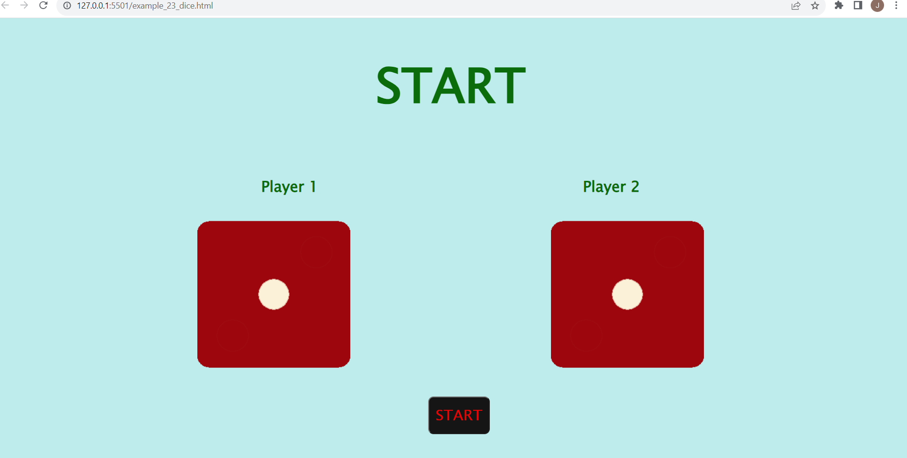

# 🎲 Dice Game - Player vs Player

This is a simple 2-player dice game built with **HTML**, **CSS**, and **JavaScript**. Each time you click the **START** button, two dice are rolled—one 
for Player 1 and one for Player 2—and the result is displayed visually along with the winner or a draw message.

---

## 🎮 Features

- Clean and minimal UI
- Two dice with random roll logic
- Winner declaration (Player 1, Player 2, or Draw)
- Interactive START button
- Dice updates every time the button is clicked

---
## 📷 Screenshots

### Initial State


### Player 1 Wins


### Player 2 Wins


### Draw


---

## 🚀 How to Run Locally

1. Clone the repository:
   ```bash
   git clone https://github.com/your-username/dice-game.git
   cd dice-game
